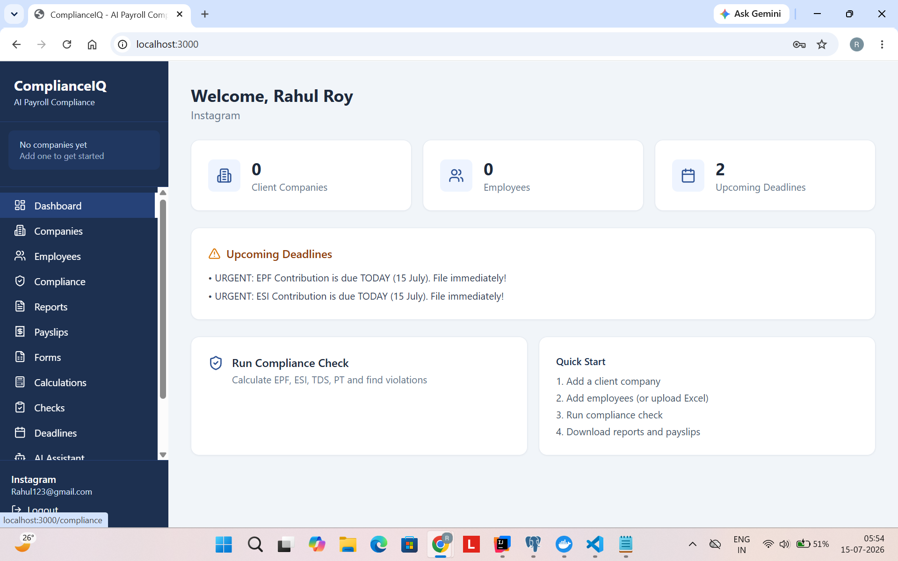
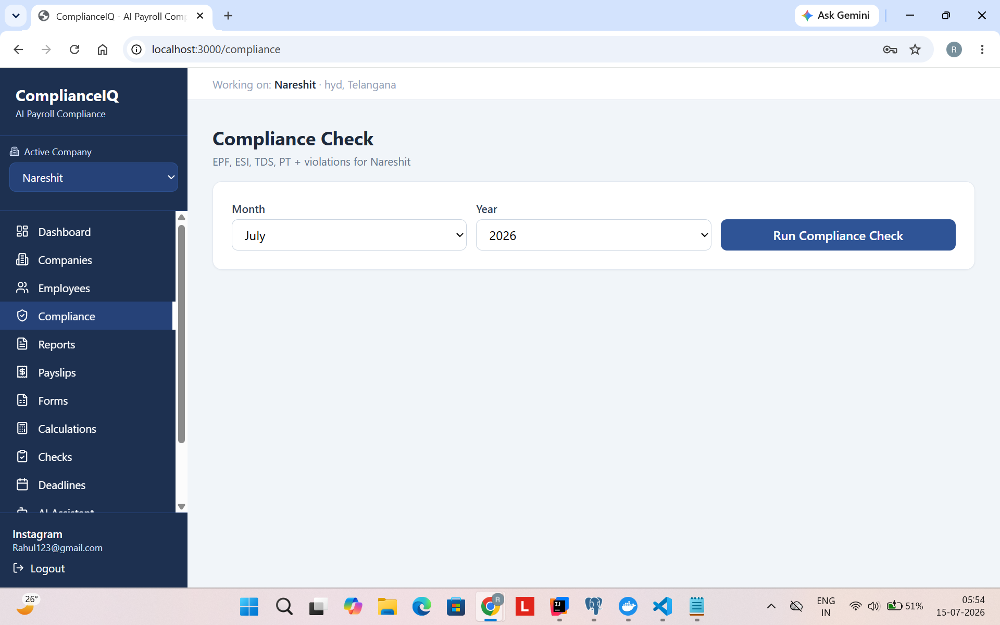
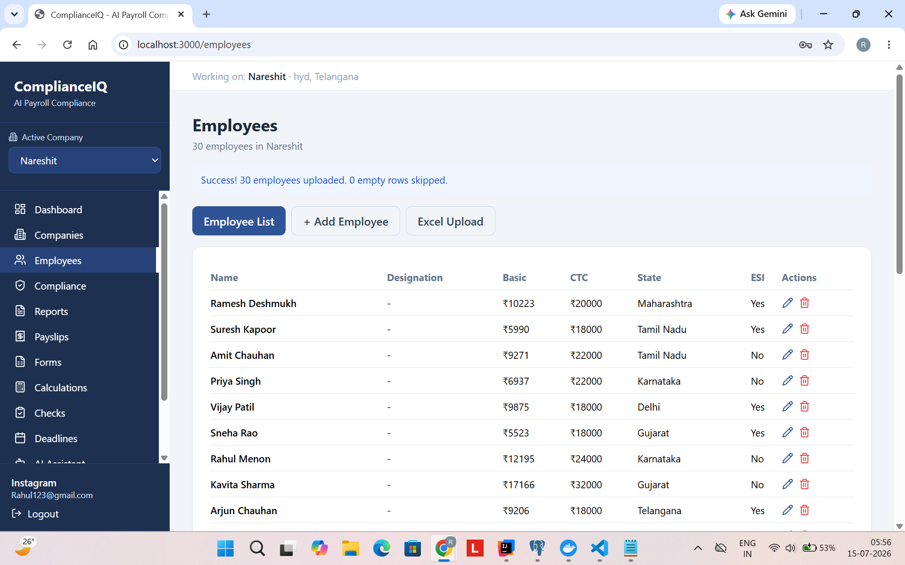
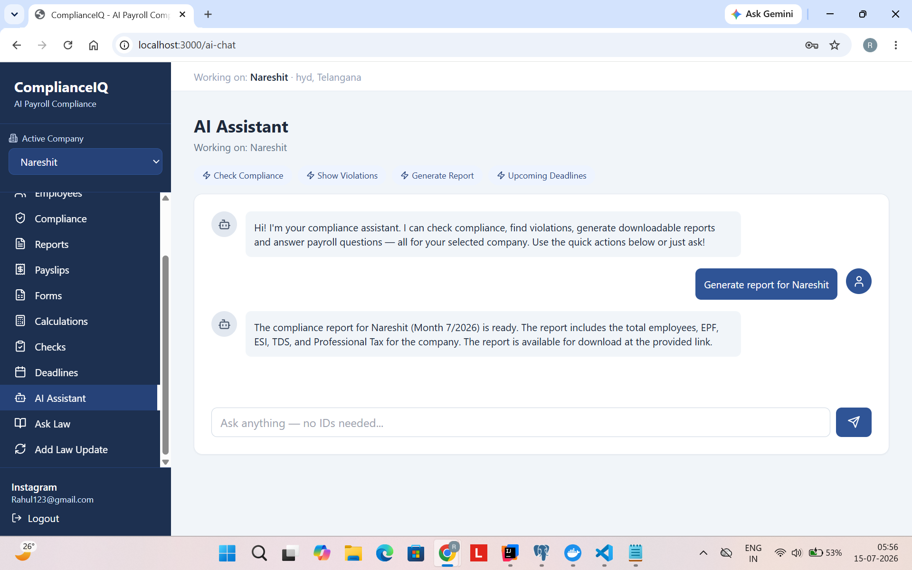
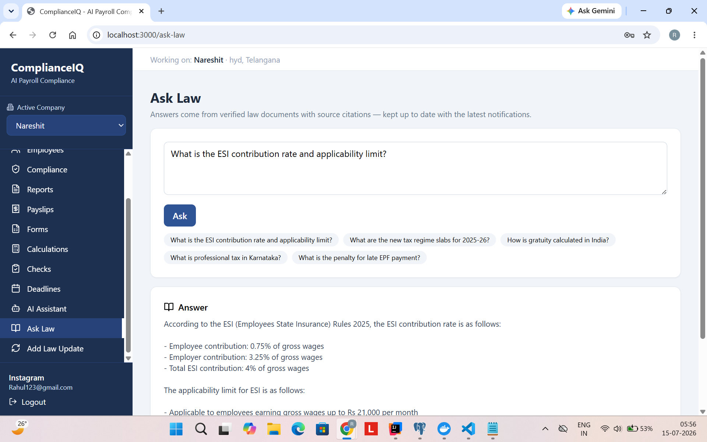
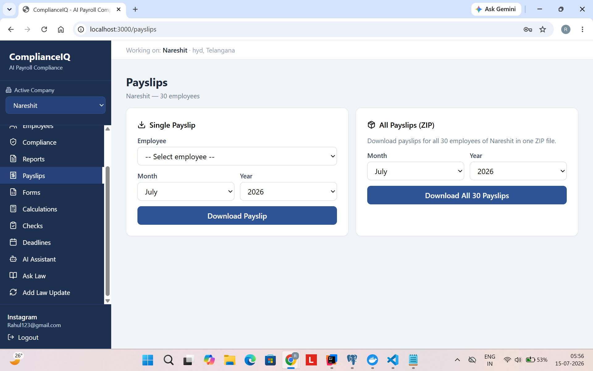
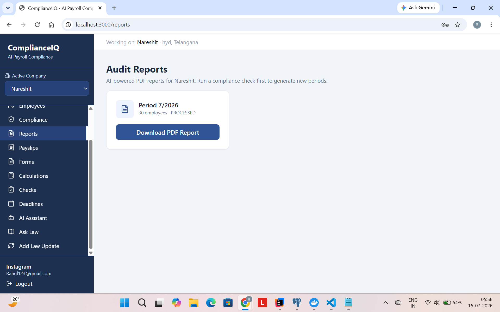
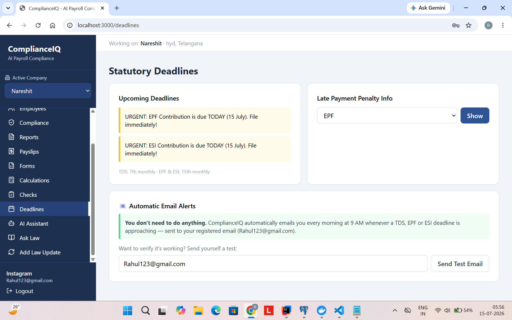

# ComplianceIQ 🇮🇳

**AI-Powered Payroll Compliance SaaS for Indian Chartered Accountants**

ComplianceIQ automates the entire payroll compliance workflow for CA firms managing multiple client companies — EPF, ESI, TDS, Professional Tax, LWF, statutory forms, audit reports, and deadline tracking — powered by an agentic AI assistant with verified, always-current legal knowledge.

> What takes a CA 2–3 hours per client in Excel, ComplianceIQ does in under 2 minutes.

---

## 📸 Product Tour

### Dashboard — everything at a glance
Client companies, employee counts, and urgent statutory deadlines the moment you log in.



### One-click Compliance Check
Select month & year — get EPF, ESI, TDS, PT totals and Labour Code violations instantly. No IDs, no spreadsheets.



### Employee Management with Excel Bulk Upload
30 employees uploaded in one click — with automatic ESI applicability, inline edit and delete.



### Agentic AI Assistant 🤖
The AI doesn't just chat — it *acts*. One click runs a real compliance check, finds violations, and generates a downloadable report for the selected company.



### Ask Law (RAG) — verified answers with sources
Answers come from actual law documents in the knowledge base, with citations — not AI guesses. New government notifications are available to every user instantly.



### Payslips — single or all 30 as ZIP


### Audit Reports, ECR Files & Statutory Deadlines
AI-summarised PDF reports per period, EPFO-format ECR generation, and automatic 9 AM email alerts for every registered firm.




---

## ✨ Key Features

### Compliance Engine
- **EPF** (12% + 12%), **ESI** (0.75% + 3.25%, ≤ ₹21,000), **TDS** (new regime slabs), **Professional Tax** (state-wise), **LWF** (16 states)
- **Labour Code 2025** — 50% basic salary rule with automatic violation detection & recommended fixes
- Minimum wage validation (state + skill level), reconciliation (missing PAN/UAN, wrong flags), contract-worker liability, full & final settlement, UAN/KYC tracking

### Documents & Forms
- **Audit-ready PDF reports** with AI-written executive summary
- Per-employee **payslips** + bulk ZIP download
- **Form 16**, **ECR file** (EPFO portal format), payment **challans**

### Agentic AI Assistant 🤖
- Built on **Spring AI + MCP tool calling** — the AI runs compliance checks, fetches violations, and generates reports on command
- One-click quick actions; selected company auto-injected — the CA never touches an ID

### RAG-Powered "Ask Law" 📚
- Answers from **verified Indian law documents** in a PGVector store — with **source citations**
- **Instant knowledge updates**: admin adds a new notification → every user gets current answers immediately (no redeploy)
- Honest AI: if the answer isn't in the knowledge base, it says so instead of guessing

### Automation
- Daily 9 AM scheduler emails deadline alerts (TDS 7th, EPF/ESI 15th) to every registered firm — zero user action
- Duplicate-safe payroll runs, soft deletes, multi-tenant data isolation

---

## 🏗️ Architecture

```
React (Vite + Tailwind)  ──nginx──►  Spring Boot 3 (Java 21)
        │                                   │
        │  JWT auth, company context        ├── PostgreSQL + PGVector (RAG store)
        │  zero-ID UX (dropdowns)           ├── Spring AI → Groq (Llama 3.1)
        │                                   ├── MCP tools (agentic actions)
        └── AI chat w/ quick actions        ├── iText PDF · Apache POI Excel
                                            └── SMTP alerts · Scheduled jobs
```

**Multi-tenant:** every CA firm's data is isolated by tenant ID enforced at the service layer.

---

## 🛠️ Tech Stack

| Layer | Technology |
|---|---|
| Backend | Spring Boot 3.3, Java 21, Spring Security (JWT), Spring AI |
| AI | Groq (Llama 3.1), RAG with PGVector, local MiniLM embeddings, MCP tool calling |
| Database | PostgreSQL 16 + pgvector extension |
| Frontend | React 18, Vite, Tailwind CSS, Axios |
| Documents | iText 7 (PDF), Apache POI (Excel) |
| Security | BCrypt, JWT, rate limiting (Bucket4j), CORS, env-based secrets |
| DevOps | Docker multi-stage builds, docker-compose, Nginx |

---

## 🚀 Run Locally

**Prerequisites:** Docker Desktop, a Groq API key (free), Gmail app password (for alerts)

```bash
# 1. Clone
git clone https://github.com/rohitsharma2256/complianceIQ.git
cd complianceIQ

# 2. Configure secrets
cp .env.example .env
# edit .env with your keys

# 3. Run everything
docker-compose up --build
```

| Service | URL |
|---|---|
| Frontend | http://localhost:3000 |
| Backend API | http://localhost:8080 |
| PostgreSQL | localhost:5433 |

**First steps in the app:** Register your firm → add a client company → upload employees via Excel → run a compliance check → download the audit report.

---

## 🔐 Security

- JWT authentication on every endpoint (only register/login public)
- BCrypt password hashing, stateless sessions
- Rate limiting: 5 login attempts/min, 100 API req/min per IP
- CORS locked to known origins
- All secrets via environment variables — nothing in code
- Multi-tenant row-level isolation

---

## 🗺️ Roadmap

- [ ] Google reCAPTCHA on login
- [ ] Role-based access (CA_ADMIN vs CA_STAFF)
- [ ] Multi-company batch operations via AI
- [ ] Government notification RSS auto-ingestion
- [ ] WhatsApp deadline alerts

---

## ⚖️ Disclaimer

ComplianceIQ is a compliance assistant. Statutory rates change periodically — always verify against official notifications before filing. Generated forms are drafts for review by a qualified professional.

---

**Built by [Rohit Sharma](https://github.com/rohitsharma2256)** · Spring Boot · Spring AI · React · Docker
